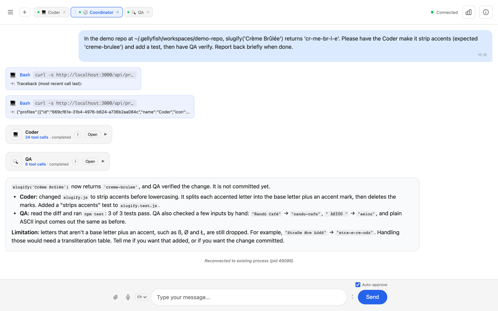
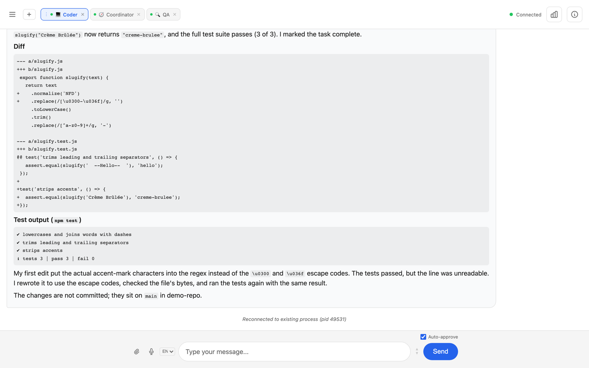
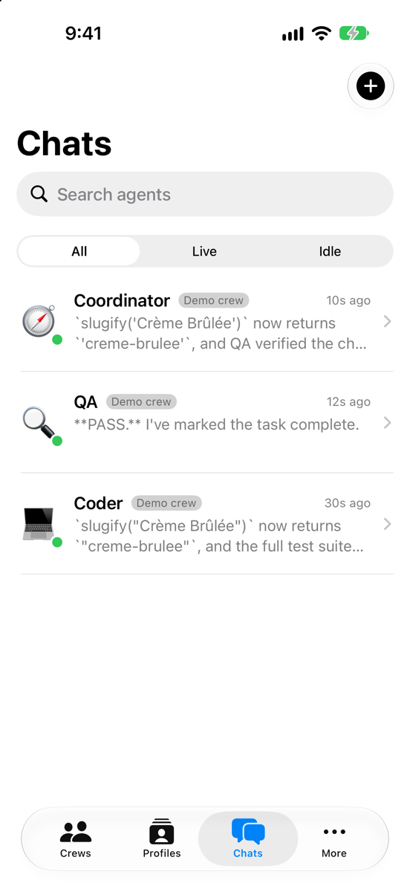
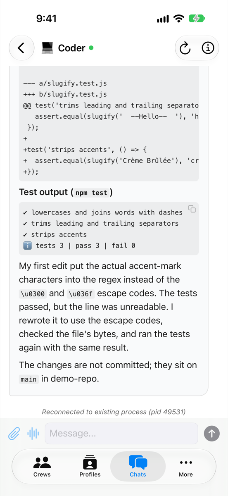
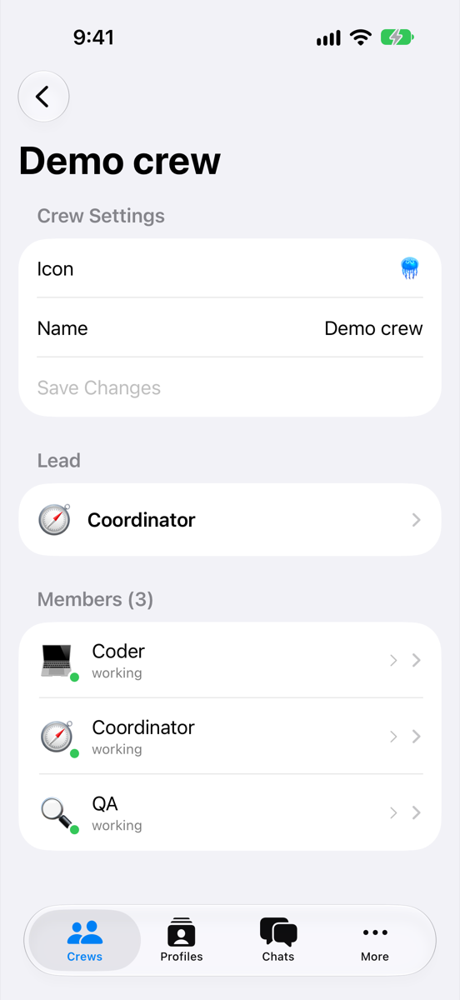

# Gellyfish Agent Platform (v1)

A self-hosted platform for running a team of Claude Code agents on a home server, with a web
UI, a native iOS app, a watchOS companion, and tool-call approvals that are signed with a key
held in the iPhone's Secure Enclave.

> **Status: archived.** Built between December 2025 and April 2026 and no longer developed.
> Claude Code now covers much of the same ground itself (remote control from a phone,
> subagents, voice input, automatic permission decisions), and the work moved on to a distributed
> redesign. This repository is published as a reference and a write-up, not as software to
> deploy. See [Known limitations](#known-limitations) before running any of it.

## What it does

- **Runs agents as real Claude Code processes.** Each agent is a long-lived `claude` CLI
  process with its own workspace, `CLAUDE.md`, skills and MCP servers. A standalone process
  manager owns the processes, so the API server can restart (or hot-reload) without killing
  agents.
- **Organises agents into crews.** A *profile* is a role definition (Coordinator, Coder, QA);
  an *agent* is an instance hired from a profile; a *crew* is a group of agents with a lead.
  Agents hand work to each other through a task API and get notified when it completes.
- **Gives you one UI for all of it.** A web app (vanilla ES modules, no framework) with tabs
  per agent, live streaming, task bubbles, image attachments, inline screenshots, reactions,
  search and voice input (whisper.cpp). The iOS app is native SwiftUI for navigation and
  input, with a web view for the chat transcript, plus on-device speech recognition.
- **Lets agents act outside the sandbox.** Through MCP servers: a browser (Playwright over
  CDP), the Mac (accessibility scripting), an iPhone (WebDriverAgent), a phone line (Twilio),
  and a credential filler that types passwords into pages without the model seeing them.
- **Requires a human signature for risky actions.** Any MCP tool can be marked `approve`.
  Calling it pauses the agent until you approve on your phone with Face ID.

The full list, with the date each feature landed and how it lines up with Claude Code, is in
[docs/FEATURES.md](docs/FEATURES.md).

## Screenshots

A demo crew (Coordinator, Coder, QA) fixing a bug in a small repository. The Coordinator
delegated the fix to the Coder and the check to QA through the task API, then reported back.

<picture>
  <source media="(prefers-color-scheme: dark)" srcset="docs/screenshots/web-chat-dark.png">
  
</picture>

The Coder's own tab, with the diff and test output it reported:



The iOS app: agent list, a chat, and the crew view.

<p>
  
  
  
</p>

## Architecture

```
 Web UI (browser)     iOS app ─ watchOS app
        │                 │  ▲
        │ WebSocket/HTTP  │  │ APNs push
        ▼                 ▼  │
 ┌──────────────────────────────────────────┐        ┌───────────────────────┐
 │ Gateway (Fastify, TypeScript)            │ HTTP   │ Vault (separate repo) │
 │  routes · WebSocket · task API · SQLite  │◄──────►│ approvals, device     │
 │  risk levels · MCP proxy · telemetry     │        │ keys, credentials     │
 └──────────────────┬───────────────────────┘        └───────────────────────┘
                    │ Unix socket
 ┌──────────────────▼───────────────────────┐
 │ Process manager (standalone daemon)      │
 │  owns child processes, buffers events    │
 └──────────────────┬───────────────────────┘
                    │ stdin/stdout (stream-json)
          ┌─────────┴─────────┐
          ▼                   ▼
   claude CLI (agent)   claude CLI (agent)  …
          │
          └── MCP servers: Playwright · Mac automation · iPhone · Twilio · keychain
```

Agents are spawned with `--permission-prompt-tool stdio` and `--strict-mcp-config`, so every
tool call that needs permission arrives at the gateway as a `control_request` event, and each
agent sees only the MCP servers assigned to its profile.

## How signed approvals work

1. **Pairing.** The iOS app generates a P-256 key pair inside the Secure Enclave; the private
   key never leaves the chip. The app sends the public key to the gateway with a 6-digit
   pairing code, and the gateway registers the device with the vault.
2. **Interception.** When an agent calls a tool marked `approve`, the gateway holds the
   `control_request` instead of answering it and asks the vault to create an approval. The
   vault returns a single-use `nonce` and an `action_hash` that binds the approval to this
   exact tool call.
3. **Push.** The gateway sends an APNs notification to the paired devices with the agent,
   tool, a readable summary, the nonce and the action hash, and shows a read-only card in the
   web UI. The watch shows the notification but cannot approve.
4. **Signing.** In the app or from the notification, you approve or reject. Face ID unlocks
   the Secure Enclave key, which signs `nonce || action_hash || "APPROVED"` (or `"REJECTED"`).
5. **Verification.** The signature goes back through the gateway to the vault, which verifies
   it against the device's registered public key. Only then does the gateway send the
   `control_response` that lets the agent continue.

The web UI cannot approve anything: an approval without a device signature is rejected.
Approval state was later moved out of the gateway's database into the vault, so that an agent
with shell access to the gateway's data directory could not approve its own requests.

## Repository layout

```
apps/
  gateway/             API server, process manager and web UI (TypeScript, Fastify, SQLite)
  ios-app/             iOS app + watchOS companion (SwiftUI, Secure Enclave, Speech, APNs)
packages/
  core/                Early agent orchestrator (superseded by the gateway)
  mcp-keychain-swift/  Credential filling over CDP with password-redacted snapshots (Swift)
  mcp-keychain/        Earlier Node version of the above
  mcp-twilio/          SMS and calls (Python)
  mcp-bluesky/         Bluesky posting and timeline (TypeScript)
config/
  skills/              Skills linked into agent workspaces (task completion, escalation, PRs)
docs/                  Architecture, agent model, deployment and monitoring notes
```

## Running it

The gateway's typecheck and tests run anywhere with Node and pnpm:

```bash
cd apps/gateway
pnpm install
pnpm typecheck
pnpm test
```

Running the full system takes considerably more. It expects macOS, the Claude Code CLI,
Chrome with remote debugging on port 9222, the vault service (not included here), an Apple
developer account for the iOS app and push notifications, and an optional repository of
profile definitions (`HQ_PATH`). The gateway itself starts with:

```bash
cd apps/gateway
pnpm dev        # port 3001, hot reload
```

## Known limitations

These were open when development stopped. They are listed because the approval system is the
main feature, and it was not finished.

- **The vault is not in this repository**, so approvals cannot work from this code alone.
- **Approval bookkeeping bugs in the vault:** duplicate approvals for the same request, and a
  case where approvals were marked approved without a matching creation record.
- **Agent-writable policy.** Tool risk levels and per-profile MCP assignments still live in a
  SQLite database that agents on the same machine can write to. The planned fix was to move
  them into read-only config files.
- **Password redaction gaps.** Some sites mask password fields with CSS instead of
  `type="password"`, and browser snapshots could include those values.
- **Single machine, single user.** Agents, the gateway and the database share one host and
  one OS user, so isolation between them depends on convention, not enforcement.
- Automated tests cover the gateway only; the iOS app has a small test target.

## What I learned

- Moving the approval decision to a separate device is the easy part. Most of the work is
  making sure nothing on the agent's own machine can forge, replay or skip that decision.
  Every shortcut (a fallback credential path, an unsigned web button, a writable policy
  table) turned out to be a bypass.
- A separate process manager that outlives the API server made it possible to hot-reload the
  server during development without losing long-running agents.
- Running agents as real Claude Code processes instead of wrapping an SDK meant every new CLI
  feature was available immediately, at the cost of driving a CLI over a stream-json protocol.

The successor design puts the coordinator, the agents' VM and an egress-filtering gateway on
separate machines, so that these guarantees come from the network layout rather than from
conventions on one host.

## License

[MIT](LICENSE)
